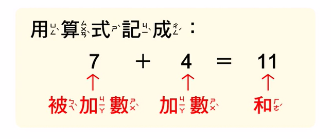
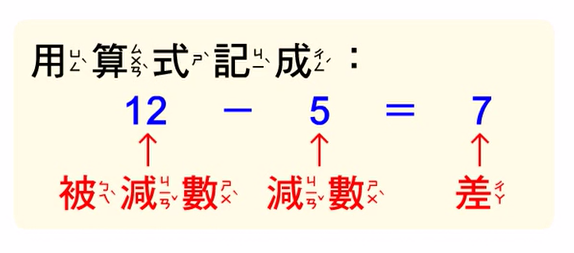
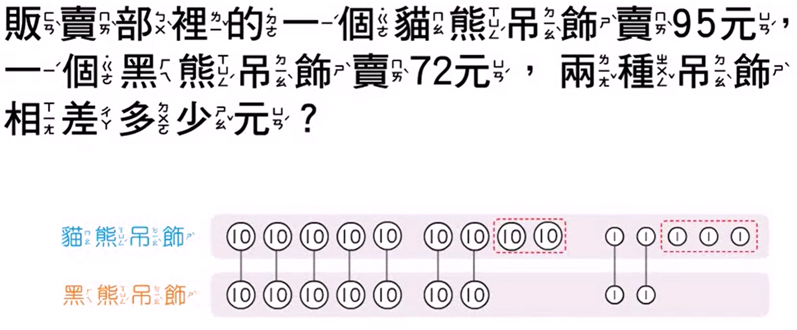
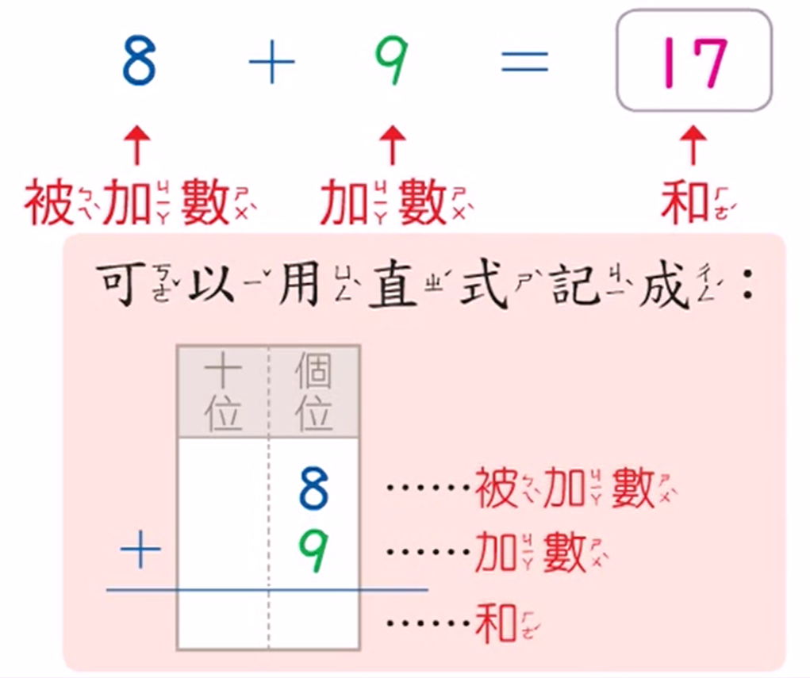
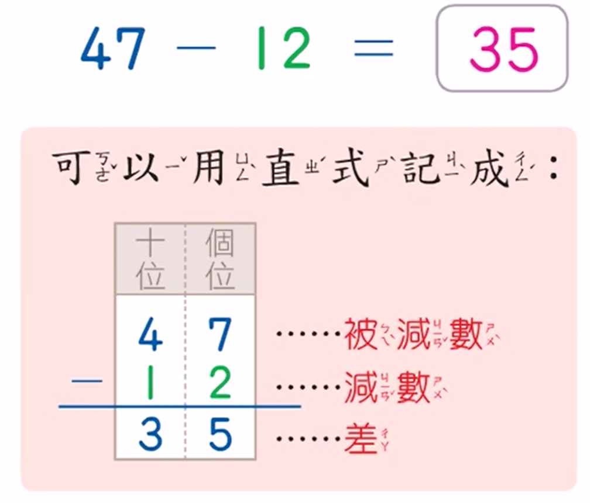

- 一個數加 0 會等於原本的數；0 加一個數也會等於原本的數。
  - $2 + 0 = 2$
  - $0 + 7 = 7$

- 一個數減掉他自己，會等於 0；一個數減掉 0，會等於他自己。
  - $5 - 5 = 0$
  - $7 - 0 = 7$

- 被加數、加數、和 :
  - 
  

- 被減數、減數、差 :
  - 

- 相差的概念 :
  - 多出來的部分就是相差。
  - 

- 直式加減 :
  - 
  - 

